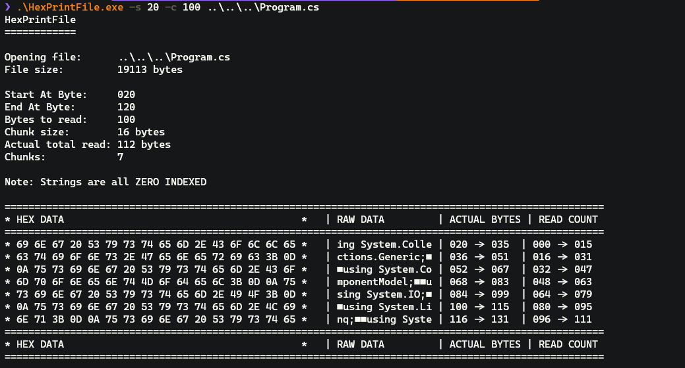

<!-- PROJECT SHIELDS -->
<!--
*** I'm using markdown "reference style" links for readability.
*** Reference links are enclosed in brackets [ ] instead of parentheses ( ).
*** See the bottom of this document for the declaration of the reference variables
*** for contributors-url, forks-url, etc. This is an optional, concise syntax you may use.
*** https://www.markdownguide.org/basic-syntax/#reference-style-links
-->
[![Contributors][contributors-shield]][contributors-url]
[![Forks][forks-shield]][forks-url]
[![Stargazers][stars-shield]][stars-url]
[![Issues][issues-shield]][issues-url]
[![MIT License][license-shield]][license-url]

<!-- PROJECT LOGO -->
<br />
<p align="center">
  <a href="https://github.com/tip2tail/HexPrintFile">
    
  </a>

  <h3 align="center">HexPrintFile</h3>

  <p align="center">
    Command line tool to view the raw hexadecimal data for a given file, or selected part of a file.
    <br>
    <a href="https://github.com/tip2tail/HexPrintFile/issues">Report Bug or Request Feature</a>
  </p>
</p>

<!-- ABOUT THE PROJECT -->
## Changelog

View the changes to this project: [Changelog](./CHANGES.md).

## Screenshot



## Built With

* C#
* .NET Core
* VS Code

## Installation
 
No installation is required, download a release from the Releases tab that applies to your system.

Alternatively, download and build on your local system.

<!-- USAGE EXAMPLES -->
## Usage

````
A tool to print the hex representation of a file, or portion of a file

Usage: HexPrintFile [options] <file>

Arguments:
  file                      File to hex print

Options:
  -?|-h|--help              Show help information
  -s|--start-byte <BYTE>    Byte to start reading from. 0 if excluded. Counted from index 0.
  -e|--end-byte <BYTE>      Byte to read to (inclusive). Reads to EOF if excluded. Counted from index 0. Cannot be used with -c.
  -c|--count-bytes <COUNT>  Returns X bytes from start byte (if provided). Cannot be used with -e.
  -x|--extended             Use extended ASCII characters in output.
  -o|--index-from-one       Index the bytes from 1 rather than 0.

> ----------------------------------------------------
> Created by Mark Young
> github.com/tip2tail
> ----------------------------------------------------
> Return Codes
> 0: Success
> 1: File not found
> 2: Satrt byte greater than the length of the file
> 3: End byte greater than or equal to the length of the file
> 4: General error displaying the data
> 5: Cannot use opptions -c and -e together
> 6: Start byte is less than zero
> 7: End byte less than start byte
> 8: Command line parsing exception
> 9: Start byte is less than one and index from one mode enabled
> ----------------------------------------------------
> Version:   1.0.0
> Buid Date: 2020-05-23 01:36:55
> ----------------------------------------------------
````

<!-- ROADMAP -->
## Roadmap

See the [open issues](https://github.com/tip2tail/HexPrintFile/issues) for a list of proposed features (and known issues).

I cannot promisse I will take any of these forward, but all proposals are welcome.


<!-- CONTRIBUTING -->
## Contributing

Contributions are what make the open source community such an amazing place to be learn, inspire, and create. Any contributions you make are **greatly appreciated**.

1. Fork the Project
2. Create your Feature Branch (`git checkout -b feature/AmazingFeature`)
3. Commit your Changes (`git commit -m 'Add some AmazingFeature'`)
4. Push to the Branch (`git push origin feature/AmazingFeature`)
5. Open a Pull Request

## Build Release Version

To build a release version use the following commands.

- Windows
````
dotnet publish -c Release --self-contained -r win-x64 /p:PublishSingleFile=true
````
- Linux
````
dotnet publish -c Release --self-contained -r linux-x64 /p:PublishSingleFile=true
````
- macOS
````
dotnet publish -c Release --self-contained -r osx-x64 /p:PublishSingleFile=true
````

<!-- LICENSE -->
## License

Distributed under the MIT License. See `LICENSE` for more information.


<!-- CONTACT -->
## Contact

Your Name - [@tip2tail](https://twitter.com/tip2tail)

Project Link: [https://github.com/tip2tail/HexPrintFile](https://github.com/tip2tail/HexPrintFile)

<!-- MARKDOWN LINKS & IMAGES -->
<!-- https://www.markdownguide.org/basic-syntax/#reference-style-links -->
[contributors-shield]: https://img.shields.io/github/contributors/tip2tail/HexPrintFile.svg?style=flat-square
[contributors-url]: https://github.com/tip2tail/HexPrintFile/graphs/contributors
[forks-shield]: https://img.shields.io/github/forks/tip2tail/HexPrintFile.svg?style=flat-square
[forks-url]: https://github.com/tip2tail/HexPrintFile/network/members
[stars-shield]: https://img.shields.io/github/stars/tip2tail/HexPrintFile.svg?style=flat-square
[stars-url]: https://github.com/tip2tail/HexPrintFile/stargazers
[issues-shield]: https://img.shields.io/github/issues/tip2tail/HexPrintFile.svg?style=flat-square
[issues-url]: https://github.com/tip2tail/HexPrintFile/issues
[license-shield]: https://img.shields.io/github/license/tip2tail/HexPrintFile.svg?style=flat-square
[license-url]: https://github.com/tip2tail/HexPrintFile/blob/master/LICENSE.txt
[linkedin-shield]: https://img.shields.io/badge/-LinkedIn-black.svg?style=flat-square&logo=linkedin&colorB=555
[linkedin-url]: https://linkedin.com/in/othneildrew
[product-screenshot]: images/screenshot.png